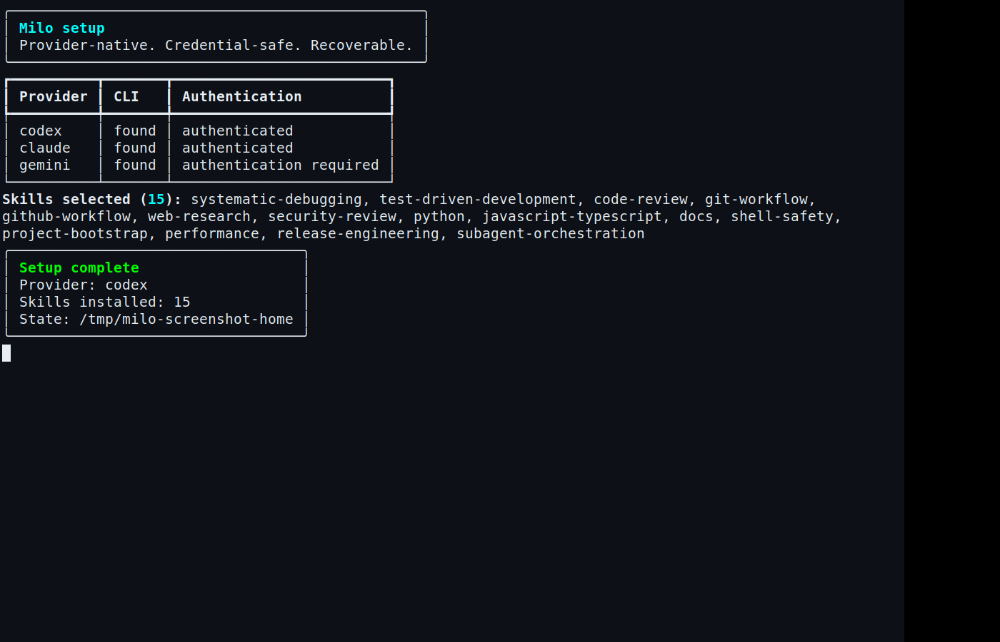
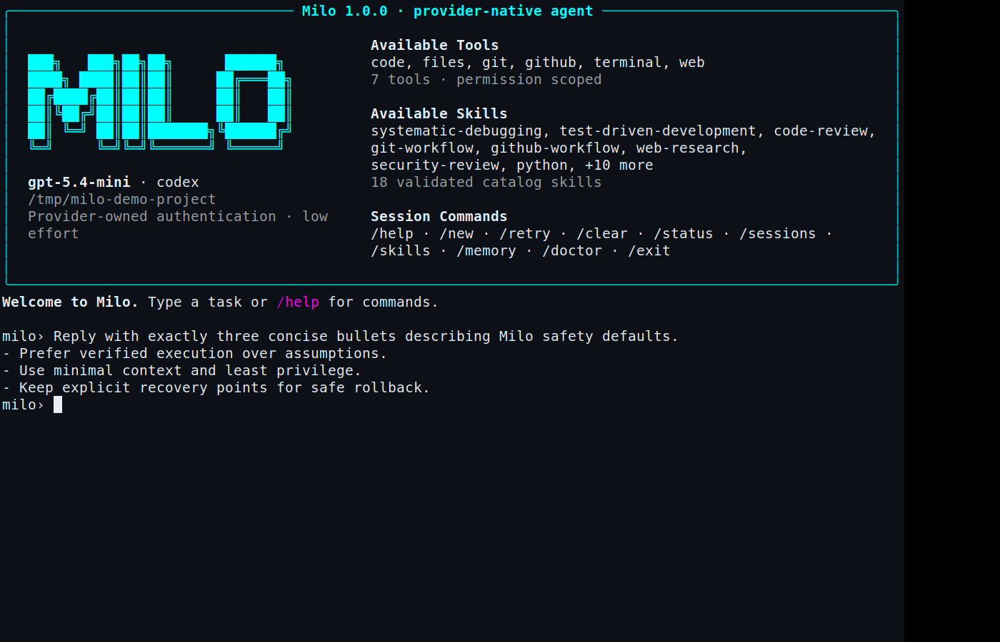
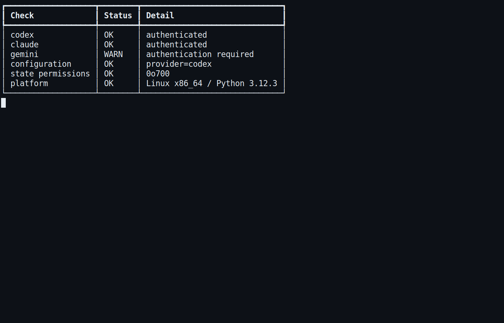

# Milo

<p align="center">
  <strong>A provider-native AI agent CLI with automatic delegation, durable context, and reversible execution.</strong>
</p>

<p align="center">
  <a href="https://github.com/codefern/milo/actions"></a>
  <a href="https://github.com/codefern/milo/blob/main/LICENSE"></a>
  
</p>

Milo turns the official Codex, Claude Code, or Gemini CLI into one consistent agent experience. It preserves each provider's native authentication and session model while adding automatic sub-agents, validated skills, searchable project memory, bounded context, Milo sessions, file checkpoints, permissioned tools, MCP configuration, and paused-by-default automation.

Milo exists because provider CLIs are excellent execution engines, but switching among them usually means losing workflow conventions, safety controls, skills, and continuity. Milo supplies that durable control plane without reading, copying, or storing provider credentials.



The screenshots are untouched direct terminal captures of Milo running in an X terminal. They were not composited, recreated from copied output, cropped, resized, annotated, or visually edited.



## Why Milo

- **Provider-native:** delegates authentication and inference to official CLIs rather than proxying credentials.
- **Automatic delegation:** simple tasks stay in one lightweight process; complex tasks are classified, divided into dynamic roles, run within a configurable concurrency cap, and synthesized by a lead agent.
- **Recovery before regret:** immutable, hashed file checkpoints restore selected workspace files after failed edits or interrupted refactors.
- **Progressive context:** ranks relevant files, excludes caches and binary content, and discloses text within a hard budget.
- **Inspectable state:** SQLite sessions and FTS5 memory are searchable, bounded, project-scoped, editable, and removable.
- **Curated skills:** 18 small built-in skill packages; 15 are selected for the recommended install. Every file is SHA-256 verified and install commands require explicit approval.
- **Least-privilege tools:** JSON schemas, explicit permissions, argv-only command execution, workspace path boundaries, protected roots, public-HTTPS research, and redacted audit events.
- **Clean automation:** jobs are inspectable and always created paused. Enabling persistence is a separate user action.



## Supported providers

Milo 1.0 supports exactly three providers:

| Provider | Install | Auth detection | Session continuation | Streaming |
|---|---|---|---|---|
| OpenAI Codex | `npm install -g @openai/codex` | `codex login status` | `codex exec resume <id>` | JSONL via `--json` |
| Anthropic Claude Code | `npm install -g @anthropic-ai/claude-code` | `claude auth status` | `--resume <id>` | `stream-json` |
| Google Gemini CLI | `npm install -g @google/gemini-cli` | official config/environment presence | `--resume <id|latest>` | `stream-json` |

Milo never implements OpenCode and never reads provider token values. Existing official sessions are reused through provider-supported resume commands. If a configured cloud backend has expired or unavailable credentials, Milo surfaces the provider error and the official login action.

## Installation

From a source checkout, the bundled installer creates an isolated `uv` tool and verifies the executable:

```bash
git clone https://github.com/codefern/milo.git
cd milo
./setup.sh
```

With `uv`:

```bash
uv tool install git+https://github.com/codefern/milo.git
milo
```

With `pipx`:

```bash
pipx install git+https://github.com/codefern/milo.git
milo
```

From a source checkout:

```bash
git clone https://github.com/codefern/milo.git
cd milo
uv sync
uv run milo
```

## First run

Run `milo`. The setup wizard:

1. inspects the platform and all three provider executables;
2. displays installation and authentication status;
3. selects a provider;
4. reuses valid native authentication when available;
5. launches the provider's official login flow only when necessary;
6. offers recommended skills, the complete catalog, or no skills;
7. hash-verifies every installed skill;
8. writes a private `0600` configuration and starts the agent.

Repeat setup at any time:

```bash
milo setup
milo setup --provider codex --skills recommended
milo setup --provider claude --skills all
milo setup --provider gemini --skills none
```

For scripts and CI, add `--non-interactive`. Missing installation or authentication exits with a useful non-zero status.

## Usage

Interactive agent:

```bash
milo
```

The interactive surface includes a Milo-branded startup dashboard, provider/model and project status, tool and skill discovery, a live status toolbar, native session continuation, and slash commands for sessions, skills, memory, diagnostics, `/retry`, `/new`, `/clear`, and exit.

One task:

```bash
milo chat "Find and fix the flaky API test"
milo chat --provider claude --model sonnet "Review this repository"
milo chat --no-delegate "Rename the local variable in parser.py"
```

Milo intentionally uses low provider reasoning effort by default. A simple request does not spawn sub-agents. A multi-part request involving research, implementation, testing, or review receives an inspectable delegation decision and dynamically selected roles.

Resume a Milo session:

```bash
milo sessions list
milo chat --resume <milo-session-id> "Continue from the last result"
milo sessions search "connection pooling"
milo sessions show <milo-session-id>
```

The matching provider session identifier remains internal session metadata and is passed only to that provider's official resume interface.

## Updates

Milo can check for and apply updates through the same CLI:

```bash
milo update
milo update check
milo update check --force
milo update check --json
milo update check --interval 7200
MILO_UPDATE_CHECK_INTERVAL_SECONDS=7200 milo update check
milo update apply
milo update apply --yes  # or -y
milo update apply --interval 0  # bypass cache timeout checks
```

`milo` also checks for releases in interactive mode and shows a brief update notice when a newer version is available.

## Status

Get a compact health snapshot of your local state:

```bash
milo status
milo status --json
```

Status includes provider/model configuration and current cached update state.

## Skills


```bash
milo skills catalog
milo skills list
milo skills install security-review
milo skills validate
milo skills remove security-review
```

The machine-readable catalog is `catalog/catalog.json`. Each package contains `SKILL.md` and `skill.json`; manifests declare name, version, source, compatibility, file hashes, requirements, and a structured installation method. Milo rejects traversal paths, symlinks, untrusted sources, incompatible versions, malformed hashes, duplicate names, and unapproved install commands.

## Memory and context

```bash
milo memory add "This service uses pytest and PostgreSQL"
milo memory search PostgreSQL
milo memory list
milo memory remove <id>
```

Memory uses SQLite FTS5, is capped per project, and supports pruning through the Python API. Milo does not automatically save every conversation as memory. Application sessions are stored separately and bounded to the latest 200 messages.

`ContextSelector` walks only the project, excludes Git metadata, virtual environments, dependency trees, caches, build output, databases, binaries, and symlinks, then ranks explicit paths and keyword matches. UTF-8 content is progressively disclosed within the configured token budget.

## Checkpoints and recovery

```bash
milo checkpoint create "before parser refactor" src/parser.py tests/test_parser.py
milo checkpoint list
milo checkpoint restore <checkpoint-id>
```

Checkpoints are workspace-bounded copies with SHA-256 integrity metadata. Restore refuses traversal and symlinks. Git remains the preferred project-wide history; Milo checkpoints provide a fast, targeted recovery layer before a commit exists.

## Tools and GitHub

Milo's modular registry provides:

- terminal execution using explicit argv and an allowlist;
- workspace-bounded file reads and writes;
- Git and GitHub CLI operations;
- public HTTPS source retrieval with private-network blocking and size limits;
- relevant code search with context budgeting;
- redacted JSON audit events.

Every tool declares an object JSON schema and one permission. Network, execution, and writes are separate grants. Git pushes, resets, cleans, repository changes, and pull-request operations require explicit approval in the command policy.

GitHub access uses the already-authenticated `gh` CLI. Milo never extracts the token from `gh`, provider stores, or environment variables.

## MCP and extensions

```bash
milo mcp add-command time uvx mcp-server-time
milo mcp add-url sentry https://mcp.sentry.dev/mcp
milo mcp sync time
milo mcp list
milo mcp unsync time
milo mcp remove time
```

MCP definitions accept either a validated argv command or a public HTTPS URL. Shell interpreters are rejected. Definitions remain local and inert until an explicit `sync` updates the selected provider through its official CLI; `unsync` removes that provider entry. Provider processes retain responsibility for discovery, transport execution, and native permission controls.

## Automation

```bash
milo automation add daily-tests "0 9 * * *" "Run the test suite"
milo automation list
milo automation enable <id>
milo automation pause <id>
milo automation remove <id>
```

Creation never silently enables a persistent job. The automation store is a private, editable schedule registry suitable for an external scheduler or a provider task runner.

## Configuration

State defaults to `~/.milo`; override it with `MILO_HOME`. Files use restrictive permissions.

```json
{
  "provider": "codex",
  "model": null,
  "max_agents": 3,
  "context_budget": 24000
}
```

Supported provider values are `codex`, `claude`, and `gemini`. Configuration writes are atomic and validated before replacement.

## Architecture

```text
CLI / setup
    │
    ├── Config + diagnostics
    ├── Agent ── delegation gate ── bounded sub-agent pool ── synthesis
    │              │
    │              └── Codex | Claude Code | Gemini provider adapters
    ├── Sessions + project memory (SQLite / FTS5)
    ├── Context selector + research source tracking
    ├── Checkpoints + automation
    ├── Validated skill catalog
    └── Permissioned tool and MCP registries
```

Milo is deliberately small: Python's standard library handles SQLite, hashing, subprocesses, networking, and persistence; Rich and prompt-toolkit provide terminal UX. External provider CLIs perform model inference and agent execution, so Milo downloads no model weights.

Detailed design notes are in [`docs/ARCHITECTURE.md`](docs/ARCHITECTURE.md). The Hermes capability comparison used during implementation is in [`docs/HERMES_COMPARISON.md`](docs/HERMES_COMPARISON.md).

## Security

Core boundaries:

- no provider credential ingestion;
- recursive secret redaction for tool arguments and errors;
- `0700` state directories and `0600` state/config files;
- canonical workspace path checks with `/opt/va-backend` protected from writes;
- no shell strings in the command policy;
- no symlinks in skill packages or checkpoints; checkpoint snapshots are read-only and hash-verified;
- trusted skill sources plus SHA-256 file verification;
- public HTTPS-only built-in research, with DNS/IP checks against local networks;
- explicit approval for high-risk Git/GitHub operations;
- bounded provider concurrency and state retention.

See [`SECURITY.md`](SECURITY.md) for reporting. Run the local audit gates with `uv run pip-audit`, `uv run ruff check .`, and `uv run mypy src/milo`.

## Testing

```bash
uv sync --group dev
uv run pytest -q
uv run ruff check .
uv run mypy src/milo
uv build
```

CI covers provider argv contracts, auth detection, stream parsing, setup, skills, memory, context selection, sessions, recovery, tools, command/path policy, MCP environment filtering, automation, delegation, secret redaction, linting, typing, and package builds. Maintainer release verification additionally executes live Codex, provider failure paths, session continuation, setup/diagnostics, dependency audit, and an isolated tmux user journey; those checks require local provider credentials and are intentionally outside public CI.

## Troubleshooting

`milo doctor` is the fastest starting point.

- **Provider missing:** install it using the exact command shown by setup, then rerun `milo setup`.
- **Authentication required:** run the displayed official provider login flow. Milo cannot and should not bypass it.
- **Configured Claude cloud backend fails:** `claude auth status --text` can show a selected third-party backend whose cloud credentials are unavailable. Repair that backend's official credentials or log into Claude Code again.
- **Gemini setup opens a selector:** choose an official Gemini authentication method; Milo will reuse the resulting local session metadata.
- **A skill fails validation:** reinstall from the catalog; do not bypass hash or source checks.
- **A provider response is malformed:** rerun `milo doctor`, update the provider CLI, and retry. Milo reports malformed JSONL without exposing a Python traceback.
- **A refactor broke files:** use `milo checkpoint list` and restore the checkpoint, or use Git for repository-wide recovery.

## Development and contribution

Fork the repository, create a focused branch, add a failing test before production code, run all four quality commands above, and submit a pull request with the observed test output. Provider behavior must be backed by the current official CLI help or documentation. New provider adapters are intentionally excluded from 1.x unless the supported-provider contract changes.

Licensed under the [MIT License](LICENSE).
